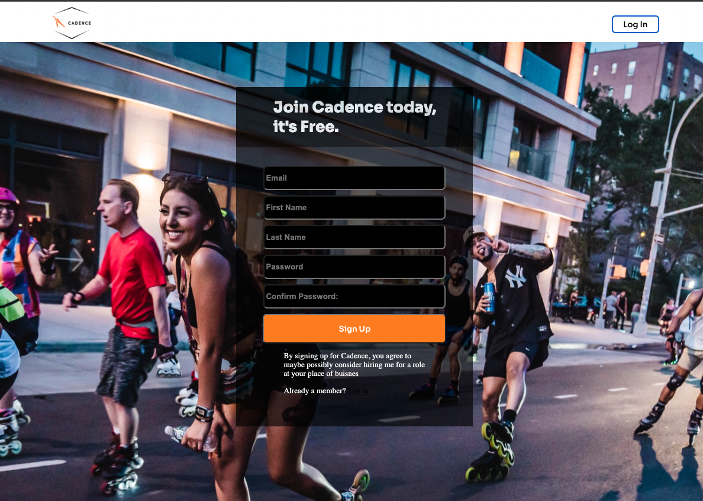

# Welcome to the Cadence!

Cadence is a fullstack clone of the fitness tracker Strava.
### <a href='https://heroku-cadence.herokuapp.com/'>Visit Cadence Here! </a>
***

## Summary
In its current state cadence will present a user with a different splash page depending on if they are logged in or not.  Logged in users will see a list of activities completed by themselves and other users on the platform.  Logged in users can also view individual activities as well as edit or delete their own activities as well as add new activities.  

## Cadence was built using
***
- Ruby 
- Ruby on Rails
- Javascript
- React 
- Redux
- PostgresSQL
- Webpack 

- Heroku (Hosting)

## Previews
***
### Splash

### Login

### Signup

### Location and session aware navigation

## Code Snippets
***

The login demo-user is its own component.  This made it possile to reuse the same component on multiple pages.  Using the path gave the ability to assign different classnames to the button depending on where it was located which provide the ability to style differntly. 

***

The session button which takes users to the login and signup pages is also location aware and will direct to the sign up page if a user clicks it from the login page or will lead to the sign up page if a user clicks it from the login page.  The button will also keep track of a logged in user, in which case it will handle logout functionality.  

